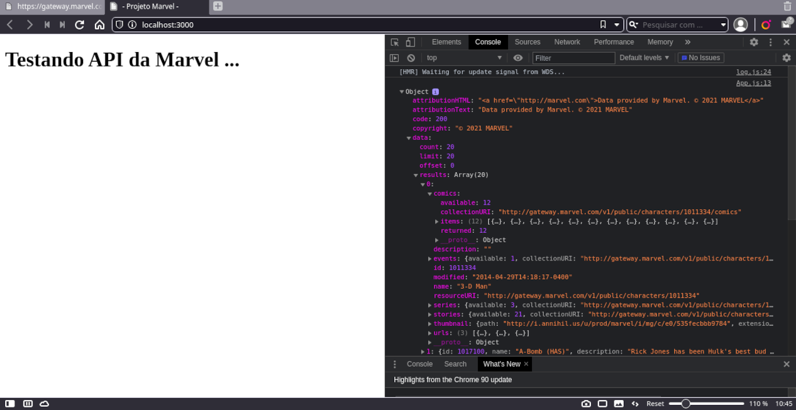
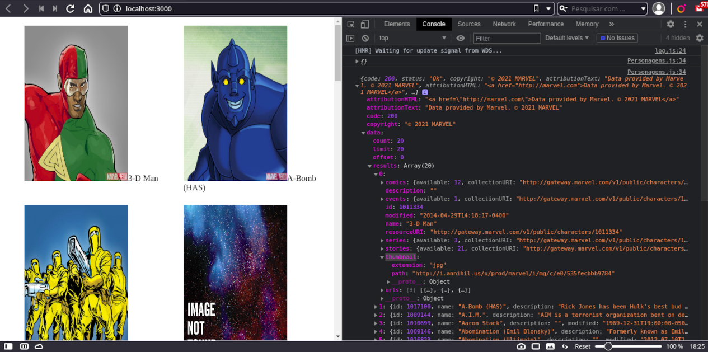

# Projeto Marvel Utilizando a API do site 

## Personagens da marvel

# API Marvel Comics

<table>
    <tr>
        <td>
        
       	 	<h2>
 	                este prejeto é sobre usar uma API da Marvel utilizando JavaScript e reactjs nodejs axios 
		os metodos utilizados nesse projeto: 
		GET - /v1/public/characters  
			GET - /V1/public/characters/{characterId} 
			<h2>Exemplo de uso da api</h2>
			<h3>http:// gateway.marvel.com/v1/public/comics? => URL BASE</h3>
	                <h3>ts=1& => TIMESTAMP</h3>
			<h3>apikey=1234& => CHAVE DA API</h3>
			<h3>hash=ffd275c5130566a2916217b101f26150 => VALOR MD5 GERADO APARTIR DO MURGE - "UNIÃO" (TS+APIKEY+API PRIVADA)</h3>
			OBS:  <h5><a href="https://developer.marvel.com/account">para obter a key publica e privada precisa se cadastrar no site official</h5></a>
       	 	</h2>
		<h2><a href="https://developer.marvel.com/docs">Marvel API</a></h2>
        
        </td>
    </tr>
</table>
				

